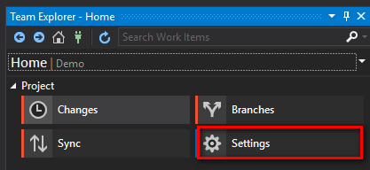
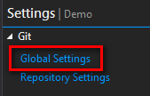
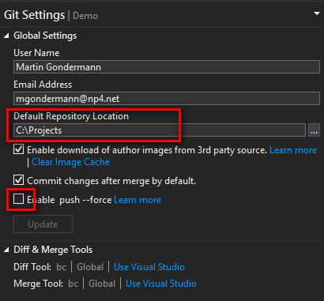
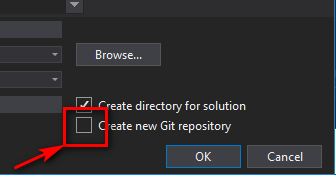

- title : Git/GitLab und Visual Studio
- description : Einführung in Git mit VS 2017
- author : Martin Gondermann
- theme : beige
- transition : slide

***

## Git/GitLab und Visual Studio

<br />
<br />

### Einführung in Git mit VS 2017

<br />
<br />
Martin Gondermann - [@magicmonty](http://www.twitter.com/magicmonty)

***

## Ersteinrichtung Git

### Installation
- Git sollte bereits mit der Installation von VS2017 auf dem Rechner sein
- **Test:**
  - Kommandozeile (cmd oder PowerShell) öffnen
  - ```git --version``` eingeben

---

## Ersteinrichtung Git

### Konfiguration

Folgende Befehle auf der Kommandozeile eingeben:

```shell
C:\> git config --global user.name "Klaus Mustermann"
C:\> git config --global user.name "kmustermann@company.com"
C:\> git config --global core.editor 'C:/Program Files (x86)/Notepad++/notepad++.exe'
C:\> git config --global http.sslverify false
```

<span style="font-size:14px">*Das <code>http.sslverify false</code> deshalb, weil das SSL-Zertifikat self-signed ist</span>

--- 

## Ersteinrichtung Git

### Konfiguration Beyond Compare

```shell
C:\> git config --global diff.tool bc
C:\> git config --global difftool.bc.path 'C:/Program Files (x86)/Beyond Compare 4/bcomp.exe'
C:\> git config --global merge.tool bc
C:\> git config --global mergetool.bc.path 'C:/Program Files (x86)/Beyond Compare 4/bcomp.exe'
```

--- 

## Ersteinrichtung Git

### Konfiguration VS 2017

 <br />

--- 

## Ersteinrichtung Git

### Konfiguration VS 2017



***

## Neues Projekt einrichten

- Projekt in VS erstellen<br />
  

---

- data-background-video : videos/new-project.mp4

***

## Vorhandenes Projekt abrufen

---

- data-background-video : videos/clone-project.mp4

***
- data-background : images/demo-time.gif

***

### Danke

* https://book.git-scm.com/book/en/v2
* https://roadtoalm.com/2013/07/19/a-starters-guide-to-git-for-tfs-gitwits/
* https://about.gitlab.com/2014/09/29/gitlab-flow/
